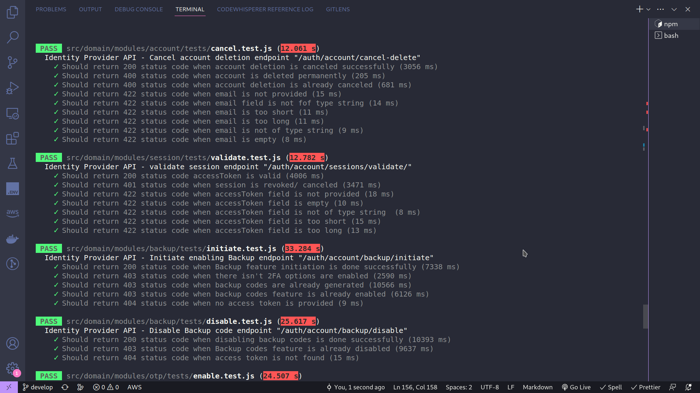
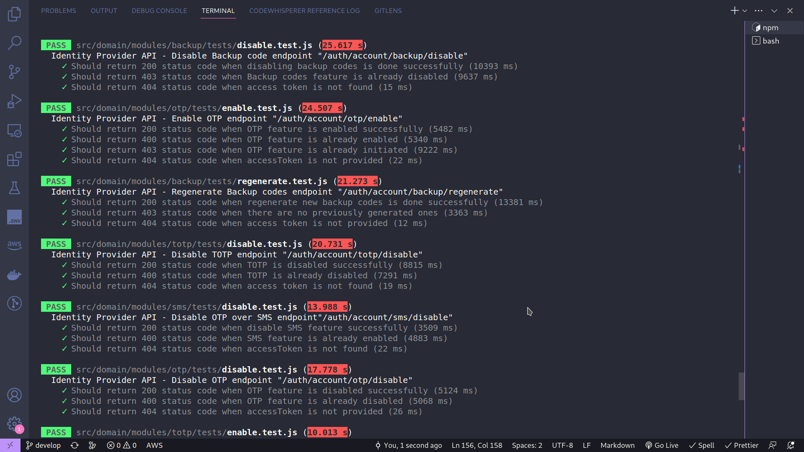

## Identity Provider:

### 1. Overview:

This API is a piece in a [Microservices project](https://github.com/hakona-Matata/), I'm working on right now. And it's for managing user identities across multiple services thought out this project.

### 2. Installation:

1.  Download the project by cloning it

```
   git clone https://github.com/Hakona-Matata/identity-provider
```

2. Install the requirements:

```
cd identity-provider
npm i
```

### 3. Configuration:

1. Prepare environment variables:

```

// Open the env.example file
// get the needed environment variables ready, such as:

MONGO_URI:"your mongodb url"
etc...

```

2. Start the server

```
// Run in any environment you want

npm run dev         // For development mode (recommend this)
npm run stage       // For staging mode
npm run prod        // For production mode

```

### 4. API Documentation:

[**Documentation link | postman**](https://documenter.getpostman.com/view/8694181/2s93eYTrWX)

While several documentation options were considered, `Postman` was chosen for this piece!

The documentation will provide a comprehensive overview for all the available endpoints, expected requirements, requests, and responses examples.

### 5. Used Tech Stack:

The core technologies, I've used were:

- `Javascript`, and actually it wasn't a good option during the development journey, I'll use "Typescript" from now on in the other project pieces!
- `ExpressJS`: A Framework built above NodeJS for creating a web applications.
- `Mongoose`: A Object Data modeling library (ODM) for **"MongoDB and NodeJS"** applications.
- `jsonwebtoken`: A library for generating and verifying tokens.
- `jest`: A javascript testing framework that's highly flexible, and can be used for a wide range from "simple unit testing" to "complex end to end (E2E) testing".

### 6. Architecture:

I've been trying to follow the **"Domain Driven Design (DDD)"** as much as possible and here it's the API architecture
:

```

/src
/core // The necessary files for making the API alive!
/domain // The domain-specific logic of the application
/infrastructure // The details of the infrastructure of the application
/shared // The shared code across the application

```

### 7. Worth Mentioning:

1. **"Some design patterns"**, I'm proud of using were:

   - **`service repository pattern`**: The basic idea is to have a service layer that provides a high-level API for the business logic, which in turn interacts with a repository layer that abstracts away the persistence details. The repository provides methods to create, read, update, and delete (CRUD) data, and the service layer uses these methods to implement business logic.

2. I've been using **"Object oriented programming (OOP)"** and utilized it's concepts and principles, such as:
   - Encapsulation
   - Abstraction
   - Composition
   - Inheritance
3. Followed **"the clean code principles"** as much as possible.

### 8. Features:

This API is categorized into modules, such as :

(See documentation for more details!)

- Auth

  - Sign up
  - Verify
  - Log In

- Session:

  - Get all
  - Cancel
  - Renew
  - Validate

- Account:

  - Deactivate
  - Confirm Activation
  - Delete
  - Cancel

- Password:

  - Change
  - Forget
  - Reset

- Otp over Email:

  - Initiate Enabling
  - Confirm Enabling
  - Verify (During login)
  - Disable

- Otp over Sms:

  - Initiate Enabling
  - Confirm Enabling
  - Verify (During login)
  - Disable

- Totp:

  - Initiate Enabling
  - Confirm Enabling
  - Verify (During login)
  - Disable

- Backup Codes:

  - Initiate Enabling
  - Confirm Enabling
  - Recover
  - Regenerate
  - Disable

### 9. Notes:

This API is not 100% finished. I Know, that I'll do more modification in the future to make suit and be easily integrated to the other pieces of the project!

### 10. Results of API tests:

<div align="center">
  
  
  
  
  
  
  
  
  
  
  
</div>
